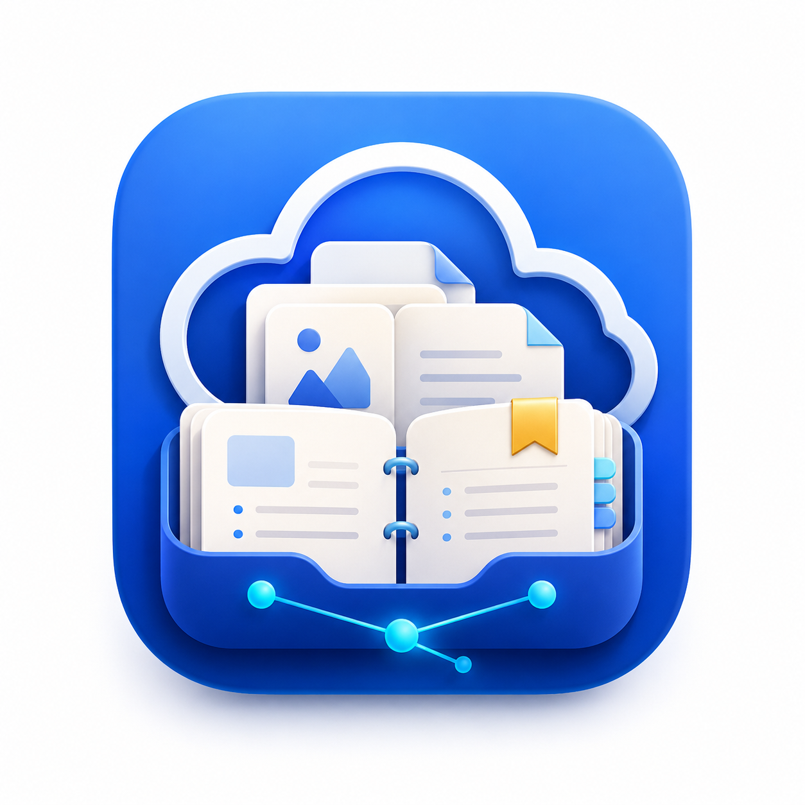

<p align="left">
  English | <a href="./README.md">简体中文</a>
</p>

<p align="center">
  
</p>

<h1 align="center">Baidu Netdisk Knowledge MCP</h1>

<p align="center">
  Turn Baidu Netdisk into an AI-readable personal knowledge base.
</p>

<p align="center">
  
  
  
  
  
</p>

---

Many people keep years of PDFs, course materials, ebooks, project documents, saved articles, and notes in Baidu Netdisk. The files are there, but finding, reading, summarizing, and organizing them is still painful.

**Baidu Netdisk Knowledge MCP** connects Baidu Netdisk to MCP-capable AI clients such as Codex, Claude Desktop, and ChatGPT. It lets AI read selected files, extract summaries and knowledge points, run reusable skills, and generate safe organization plans.

Use it when you want to:

- Ask AI to read PDFs, notes, documents, and course materials stored in Baidu Netdisk.
- Extract summaries, key points, questions, tags, and action items from scattered files.
- Turn cloud-drive folders into a personal knowledge base.
- Review an organization plan before moving any files.
- Process different material types with reusable Markdown/YAML skills.

## What Makes It Different

This is not another cloud-drive UI, and it is not just a thin upload/download wrapper.

It is an **AI knowledge assistant interface**:

1. You authorize Baidu Netdisk by scanning a QR code.
2. You ask AI to search or browse files.
3. You select one or more files.
4. AI reads the content and produces notes, summaries, tags, and folder suggestions.
5. Organization is dry-run first, so files are not moved without your approval.

## Example Scenario

You can ask your AI client:

> Find my MCP-related files in Baidu Netdisk, read the recent documents, summarize them as knowledge notes, and suggest where they should be filed.

The MCP server can then:

- Search Baidu Netdisk files.
- Return a numbered file list.
- Create a reusable `selectionId`.
- Download and parse selected files.
- Generate structured notes and organization suggestions.

Example output:

```json
{
  "title": "MCP Study Notes",
  "category": "AI",
  "tags": ["MCP", "Knowledge Management"],
  "summary": "These files explain MCP tool calling, protocol concepts, and client integration.",
  "keyPoints": ["MCP lets AI call external tools", "It can become a personal knowledge-base gateway"],
  "questions": ["Which clients support MCP?"],
  "actionItems": ["Build a list of useful MCP servers"],
  "suggestedFolder": "/apps/Knowledge Base/AI/MCP"
}
```

## Features

| Feature | Description |
| --- | --- |
| QR login | Build Baidu OAuth links, terminal QR codes, and PNG data URLs |
| Flexible file selection | Select by numbered search results, remote paths, `fs_id`, recursive directories, and file types |
| Document reading | Parse `.txt`, `.md`, `.json`, `.csv`, `.pdf`, and `.docx` |
| Long-document chunking | Split long files into chunks for safer AI context usage |
| Knowledge analysis | Summaries, key points, questions, action items, tags, value judgment, and suggested folders |
| Custom skills | Add Markdown/YAML processing templates without changing code |
| Safe organization | Generate dry-run plans before any move/delete action |
| Audit log | Record executed write operations as local JSONL logs |

## Built-In Skills

- `knowledge-notes`: turn scattered files into structured knowledge notes.
- `course-notes`: extract concepts, exercises, and review hints from course materials.
- `paper-reader`: read papers and extract problems, methods, evidence, and conclusions.
- `book-summary`: summarize books and long-form reading materials.
- `cleanup-organizer`: suggest cleanup, archive, and classification plans.

## Safety Model

The server is conservative by default:

- It does not automatically move or delete Baidu Netdisk files.
- Organization is dry-run first.
- Deletion requires `confirm: "DELETE"`.
- Tokens are stored under the user home directory by default.
- Local file access is restricted by `BAIDU_LOCAL_ROOT`.
- Write operations are restricted to `/apps/<appName>` by default.

## Who Is This For?

- People who store learning materials, papers, ebooks, and project docs in Baidu Netdisk.
- People who want to turn Baidu Netdisk into an AI-readable knowledge base.
- Users of Codex, Claude Desktop, ChatGPT, or other MCP-capable clients.
- Personal knowledge-management users who do not want to manually download and copy file contents.

## Not For

- People looking for a full graphical Baidu Netdisk app.
- People who only need sync, upload, or download.
- People who do not want to configure a Baidu Open Platform app.
- People who do not use an MCP-capable AI client.

## Quick Start

Clone and build:

```bash
git clone https://github.com/capwitf/baidu-netdisk-knowledge-mcp.git
cd baidu-netdisk-knowledge-mcp
npm install
npm run build
```

Prepare Baidu Open Platform credentials:

```bash
BAIDU_APP_KEY=your-app-key
BAIDU_SECRET_KEY=your-secret-key
```

Run locally:

```bash
node dist/cli.js
```

## MCP Client Config

Replace the path with your local repository path:

```json
{
  "mcpServers": {
    "baidu-netdisk-knowledge": {
      "command": "node",
      "args": ["C:/path/to/baidu-netdisk-knowledge-mcp/dist/cli.js"],
      "env": {
        "BAIDU_APP_KEY": "your-app-key",
        "BAIDU_SECRET_KEY": "your-secret-key",
        "BAIDU_REDIRECT_URI": "oob",
        "BAIDU_LOCAL_ROOT": "C:/path/to/baidu-netdisk-knowledge-mcp"
      }
    }
  }
}
```

## First Authorization

1. Create an app in [Baidu Netdisk Open Platform](https://pan.baidu.com/union/home).
2. Save the app `AppKey` and `SecretKey`.
3. Call `baidu_auth_qrcode` from your MCP client.
4. Scan the QR code and pass the returned `code` to `baidu_auth_exchange_code`.
5. Tokens are saved locally and refreshed automatically when needed.

## Common Workflow

Search files:

```json
{
  "tool": "baidu_search_selectable_files",
  "args": {
    "key": "MCP",
    "dir": "/apps/Knowledge Base",
    "recursion": true
  }
}
```

Select by indexes:

```json
{
  "tool": "baidu_select_files",
  "args": {
    "resultId": "res_xxx",
    "select": "1,3,5-9"
  }
}
```

Read and analyze:

```json
{ "tool": "baidu_read_selection", "args": { "selectionId": "sel_xxx" } }
{ "tool": "baidu_analyze_selection", "args": { "selectionId": "sel_xxx" } }
{ "tool": "baidu_run_skill", "args": { "selectionId": "sel_xxx", "skill": "knowledge-notes" } }
```

Generate an organization plan:

```json
{
  "tool": "baidu_plan_organize_selection",
  "args": {
    "selectionId": "sel_xxx",
    "targetRoot": "/apps/Knowledge Base"
  }
}
```

`baidu_plan_organize_selection` only returns a plan. It does not move files.

## Tools

<details>
<summary>Authorization</summary>

- `baidu_auth_status`
- `baidu_auth_url`
- `baidu_auth_qrcode_url`
- `baidu_auth_qrcode`
- `baidu_auth_exchange_code`
- `baidu_auth_refresh`

</details>

<details>
<summary>Browse and selection</summary>

- `baidu_quota`
- `baidu_list_files`
- `baidu_list_all_files`
- `baidu_search_files`
- `baidu_search_selectable_files`
- `baidu_list_selectable_files`
- `baidu_select_files`
- `baidu_file_metas`

</details>

<details>
<summary>Knowledge base</summary>

- `baidu_read_selection`
- `baidu_analyze_selection`
- `baidu_list_skills`
- `baidu_run_skill`
- `baidu_plan_organize_selection`

</details>

<details>
<summary>File operations</summary>

- `baidu_create_folder`
- `baidu_rename_file`
- `baidu_copy_file`
- `baidu_move_file`
- `baidu_delete_file`
- `baidu_upload_file`
- `baidu_download_file`
- `baidu_operation_log`

</details>

## Custom Skills

Put `.md`, `.markdown`, `.yaml`, or `.yml` files in `BAIDU_SKILLS_DIR`.

Markdown example:

```markdown
---
name: my-research-note
description: Research note extractor
category: research
outputSchema: knowledge-note
---

Extract thesis, evidence, questions, and follow-up tasks.
```

Use `baidu_list_skills` to list skills and `baidu_run_skill` to run one.

## Configuration

See `.env.example` for all options.

| Variable | Description | Default |
| --- | --- | --- |
| `BAIDU_APP_KEY` | Baidu Open Platform AppKey | Required |
| `BAIDU_SECRET_KEY` | Baidu Open Platform SecretKey | Required |
| `BAIDU_REDIRECT_URI` | OAuth redirect URI | `oob` |
| `BAIDU_SCOPE` | OAuth scope | `basic,netdisk` |
| `BAIDU_TOKEN_STORE` | token file | `~/.baidu-netdisk-mcp/tokens.json` |
| `BAIDU_OPERATION_LOG` | write-operation audit log | `~/.baidu-netdisk-mcp/operations.jsonl` |
| `BAIDU_SELECTION_STORE` | selection store | `~/.baidu-netdisk-mcp/selections.json` |
| `BAIDU_CACHE_ROOT` | local cache root | `~/.baidu-netdisk-mcp/cache` |
| `BAIDU_SKILLS_DIR` | custom skills directory | `~/.baidu-netdisk-mcp/skills` |
| `BAIDU_LOCAL_ROOT` | local file access root | current working directory |
| `BAIDU_STRICT_APP_PATHS` | restrict writes to `/apps/<appName>` | `true` |
| `BAIDU_UPLOAD_CHUNK_SIZE_BYTES` | upload chunk size | `4194304` |
| `BAIDU_TRANSFER_MAX_RETRIES` | upload/download retries | `3` |

## Development

```bash
npm run check
```

This runs TypeScript build and Vitest tests.

## Keywords

`Baidu Netdisk MCP`, `Baidu Pan MCP`, `百度网盘 MCP`, `Baidu Netdisk Knowledge Base`, `AI knowledge base`, `MCP server`, `personal knowledge management`, `AI file organizer`

## References

- [Baidu Netdisk OAuth](https://pan.baidu.com/union/doc/ol0rsap9s)
- [List files](https://pan.baidu.com/union/doc/nksg0sat9)
- [File metadata](https://pan.baidu.com/union/doc/Fksg0sbcm)
- [Download](https://pan.baidu.com/union/doc/pkuo3snyp)
- [Upload](https://pan.baidu.com/union/doc/3ksg0s9ye)
- [MCP TypeScript SDK](https://github.com/modelcontextprotocol/typescript-sdk)

## License

MIT
